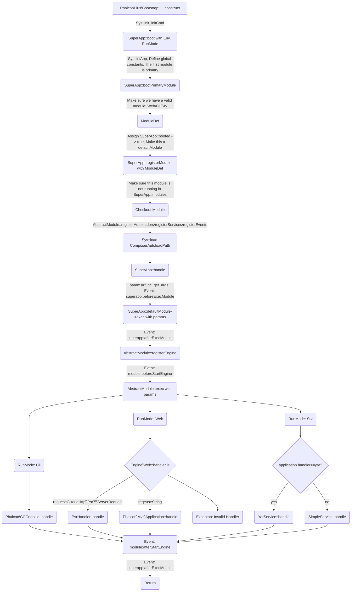

# Phalcon+

[Phalcon+](http://phalconplus.bullsoft.org) 是一个轻量级的基于 [PhalconPHP](http://www.phalconphp.com) 的Zephir/C框架。我们想为Phalcon开发者构建一个一步到位的解决方案。正是因为Phalcon极高的灵活性，赋予了开发者过多的选择权。有时候路口太多容易迷失，所以当我做完这一系列选择后，我把这个过程记录了下来，并逐渐演化成了现在的Phalcon+。为了让每个开发者不重复去做这些选择，我毅然将Phalcon+开源，供大家交流和学习。

So, 总结来说，Phalcon+并不是一个全新的框架，而是对Phalcon框架的一次优秀实践，是对Phalcon框架的再次加工和补充，能让Phalcon开发者更简单地入门和精通，最后达到天人合一的最高境界。

## 依赖
    * PHP 7.0 or above
    * cPhalcon 3.4.x，在官方发布3.4.6之前一定要下载此分支，通过`zephir build`手动编译phalcon - https://github.com/phalcon/cphalcon/tree/3.4.x
      > 安装zephir之前，需要先安装扩展 https://github.com/phalcon/php-zephir-parser ，然后使用`composer`安装`zephir`
      `composer global require phalcon/zephir`

## 约束
 - 不支持Phalcon的多模块结构，Phalcon+有自己的模块机制
 - 所有模块目录结构都是同构的
 - 模块是有工作模式的，如：Web, Srv, Cli等...，不同模式的模块角色不一样
 - 无论哪种模式，入口文件都完全一样
 - 内置RPC服务端和客户端
 - 所有模块都依赖全局的common（实际上是一个Phalcon+Cli模块）

## MaaS & MaaL 
 - MaaS(Module as a Service): Phalcon+模块即服务，`Srv`提供Rpc服务，`Web`可提供Restful服务
 - MaaL(Module as a Library): Phalcon+模块即类库，可在项目其他模块通过`App::import("test")`引入test模块

## 安装
```
➜ git clone https://github.com/bullsoft/phalconplus.git
➜ cd phalconplus/ext/
➜ /usr/bin/phpize
➜ ./configure --with-php-config=/usr/bin/php-configure
➜ make
➜ make install
```

## 框架执行流程


## 创建应用
```
# 下载骨架
➜ composer create-project bullsoft/fp-project fp-app
# 生成模块，假设生成的模块名为test
➜ cd fp-app
➜ ./common/bin/fp-devtool module:create

现在开始引导您创建Phalcon+模块 ...
Step 1 请输入该模块的名称，如"api"
[Enter]: test
Step 2 ...
...
...
```
一个Web模块的结构如下，Web模块中集成了所有的模式，包括Cli，RpcService。
```
test
.
├── app
│   ├── Module.php
│   ├── auth
│   │   ├── AclResources.php
│   │   ├── Model.php
│   │   ├── Resources
│   │   │   ├── Actions.php
│   │   │   └── Models.php
│   │   └── User.php
│   ├── config
│   │   └── dev.php
│   ├── controllers
│   │   ├── BaseController.php
│   │   ├── ErrorController.php
│   │   ├── IndexController.php
│   │   ├── UserController.php
│   │   └── apis
│   │       └── DemoController.php
│   ├── events
│   │   ├── Acl.php
│   │   ├── AppConsole.php
│   │   ├── AppHandler.php
│   │   ├── BackendServer.php
│   │   ├── Db.php
│   │   ├── EventProvider.php
│   │   ├── Model.php
│   │   ├── MvcDispatch.php
│   │   ├── Router.php
│   │   ├── SuperApp.php
│   │   └── View.php
│   ├── exceptions
│   │   ├── EnumExceptionCode.php
│   │   ├── Handler.php
│   │   ├── UnknownException.php
│   │   ├── UserAlreadyExistsException.php
│   │   └── UserNotExistsException.php
│   ├── plugins
│   │   └── Volt.php
│   ├── providers
│   │   ├── CookieServiceProvider.php
│   │   ├── CryptServiceProvider.php
│   │   ├── DatabaseServiceProvider.php
│   │   ├── DispatcherServiceProvider.php
│   │   ├── LoggerServiceProvider.php
│   │   ├── RedisServiceProvider.php
│   │   ├── RouterServiceProvider.php
│   │   ├── RpcServiceProvider.php
│   │   ├── ServiceProvider.php
│   │   ├── SessionServiceProvider.php
│   │   ├── UrlServiceProvider.php
│   │   └── ViewServiceProvider.php
│   ├── routes
│   │   ├── Api.php
│   │   └── Bare.php
│   └── views
│       ├── error
│       │   ├── show403.volt
│       │   ├── show404.volt
│       │   └── show500.volt
│       ├── index
│       │   └── index.volt
│       └── index.volt
├── cli
│   ├── init.php
│   └── tasks
│       └── HelloTask.php
├── public
│   ├── index.php
│   └── rpc.php
├── src
│   ├── models
│   │   └── UserModel.php
│   ├── protos
│   │   ├── Enums
│   │   │   └── UserStatus.php
│   │   └── Schemas
│   │       └── RegInfo.php
│   └── services
│       ├── BaseService.php
│       └── DemoService.php
└── var
    └── cache
```

## 运行

### 使用[Phalcon+DevTool](https://github.com/bullsoft/fp-common)
```bash
➜ ./common/bin/fp-devtool server:start test

正在为您启动服务器...
{
    "command": "{ (php -S 0.0.0.0:8181 -t public/ .htrouter.php) <&3 3<&- 3>/dev/null & } 3<&0;pid=$!; echo $pid > /path/to/test/var/run/server.pid",
    "pid": 8249,
    "running": true,
    "signaled": false,
    "stopped": false,
    "exitcode": -1,
    "termsig": 0,
    "stopsig": 0
}
... 启动成功，请使用 http://127.0.0.1:8181 访问
```
### 使用[PPM](https://github.com/php-pm/php-pm)
```
➜ cd test
➜ ../vendor/bin/ppm start --bridge="PhalconPlus\\Bridge" --bootstrap="PhalconPlus\\Bootstrap" --static-directory=public/ --port=8181 --workers=2
```
当然也可以创建配置文件，以便每次启动更方便
```
➜ cd test
➜ touch ppm.json
➜ ../vendor/bin/ppm start -c ppm.json
```

ppm.json内容如下：
```json
{
    "bridge": "PhalconPlus\\Bridge",
    "host": "127.0.0.1",
    "port": 8181,
    "workers": 2,
    "app-env": "dev",
    "debug": 1,
    "logging": 1,
    "static-directory": "public/",
    "bootstrap": "PhalconPlus\\Bootstrap",
    "max-requests": 1000,
    "concurrent-requests": 20,
    "php-cgi": "/usr/local/opt/php@7.2/bin/php"
}
```
### 使用[RoadRunner](https://github.com/spiral/roadrunner)
```
➜ composer require spiral/roadrunner
➜ cd test
➜ touch .rr.json
➜ touch psr-worker.php
```
.rr.json内容如下：
```json
{
  "http": {
    "address": "0.0.0.0:8181",
    "workers": {
      "command": "/usr/local/opt/php@7.2/bin/php psr-worker.php",
      "relay": "unix://rr.sock",
      "pool": {
        "numWorkers": 2
      }
    }
  },
  "static" : {
  	"enable" : true,
  	"dir": "public",
  	"forbid": [".php", ".htaccess"]
  }
}
```
psr-worker.php内容如下：
```php
<?php

use Spiral\Goridge;
use Spiral\RoadRunner;
use PhalconPlus\Http\PsrResponseFactory;

ini_set('display_errors', 'stderr');

$app = (new PhalconPlus\Bootstrap(__DIR__))->app();

$worker = new RoadRunner\Worker(
    new Goridge\SocketRelay(__DIR__."/rr.sock", null, Goridge\SocketRelay::SOCK_UNIX)
);

$psr7 = new RoadRunner\PSR7Client($worker);

while ($req = $psr7->acceptRequest()) {

    try {
        $resp = $app->handle($req);
    } catch (\Throwable $e) {
        Test\Exceptions\Handler::catch($e);
        $resp = $app->response();
    }

    $psr7->respond(PsrResponseFactory::create($resp));
    $app->terminate();
    unset($req, $resp);
}
```
然后在模块目录下执行
```
➜ rr serve -d -v
```

### 使用Nginx
配置文件
```nginx
server {
      listen 8181;
      server_name localhost;
      access_log  /var/log/nginx/test.access.log;

      index index.php index.html index.htm;

      set $root_path '/home/work/wwwroot/fp-app/test/public';

      root $root_path;

      try_files $uri $uri/ @rewrite;

      location @rewrite {
          rewrite ^/(.*)$ /index.php last;
      }

      location ~ \.php {
          fastcgi_pass unix:/run/php/php7.2-fpm.sock;
          include fastcgi_params;
          fastcgi_param SCRIPT_FILENAME $document_root$fastcgi_script_name;
      }

      location ~* ^/(css|img|js|flv|swf|download)/(.+)$ {
          root $root_path;
      }

      location ~ /\.ht {
          deny all;
      }

}
```
## 反馈&支持

欢迎任何反馈，也希望得到大家的捐助支持。

祝一切顺利没八二哥 :)
      


